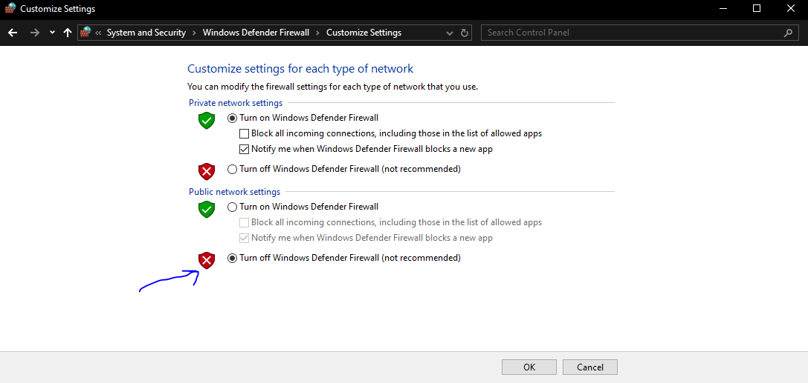
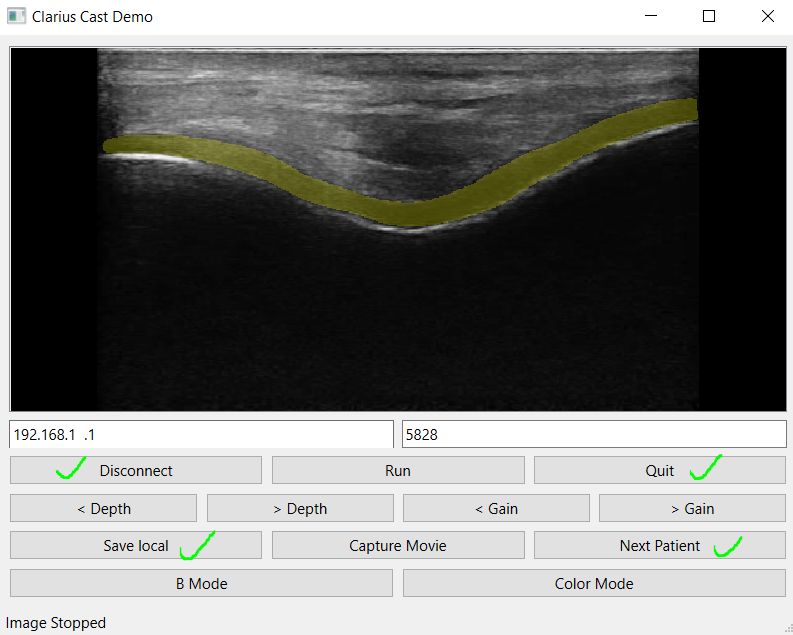

# Environment setup
Please note that this repository has only been tested only on a Windows PC.

Clone the repository and machine learning model using the following command
```
git clone https://github.com/alvinkimbowa/clarius_model_integration.git

curl https://ubcca-my.sharepoint.com/:u:/g/personal/alvinbk_student_ubc_ca/EeNt5b_A10ZEjd5XniN97osBmknefOF9QTV4zNGz08nJIg?e=RaT8D2 -o nnunet_model.pth
```

Install the necessary dependents, create a python environment and install the requirements using the commands below. Please note that this repository has only been tested with python environments. Anaconda environments may throw errors.

```
python -m venv venv

cd venv/Scripts
activate
cd ../../

pip install -r requirements.txt
```

# Running the application
Before running the application
1) Disconnect the laptop from the internet (remove ethernet cable and also disconnect from internet wifi)
2) Then turn Windows Defender Firewall (Public network settings) off as shown in the image below. This will allow you to stream images from the probe to the laptop. if you don't do this, you won't see any images in the steps that follow.

> :warning: **Ensure to turn back on Windows Defender Firewall later after running the application to ensure safety of your computer.** :warning:




Once you've installed the necessary libraries and disabled Windows Defender Firewall, you are good to go. Launch the application by running the following command in terminal. This will start a graphical user interface GUI.

```
python pysidecaster.py
```

## Connecting to the Clarius probe
1) Switch on the probe, and connect with your phone as usual.
2) Connect your laptop to the Clarius probe WIFI.
(The WIFI name will be something like DIRECT-L15HD3* for the L15 HD3 probe.)
3) Enter the probe IP address and Port number in the GUI that was launched in the previous step. (Note, if you have a research interface, you can set the Clarius Cast to Research (5828) in the Clarius App settings. With this setting, you won't have to always enter the IP address and Port as they will be automatically filled in when you launch the GUI).
4) Click the connect button on the GUI.

You should be able to see the ultrasound images on the screen.

# Graphical User Interface
The GUI has many buttons but most of them are not functional with the current implementation. The buttons you may find of interest are;

1) `Connect/Disconnect`: This initiates and stops the streaming of images from the probe to the GUI
2) `Save local`: This toggles saving of the ultrasound scans. If you want to save the current scanning procedure, click this button once. Images will start saving in the folder `recorded_data`.
3) `Next patient`: The recorded data is organized by day, and patient, i.e., all scans taken on a certain day will be saved in the same folder. Within the folder, all scans taken after clicking `next patient` will be saved in the same folder. The folders will be numbered `Patient_1, Patient_2, Patient_3...`. Every time you click `next patient`, you will need to click `save local` in order to save the images.
4) `Quit`: This will exit the application.

Below is a sample of the GUI. The buttons ticked with green will work as expected. The rest are not necessary for this implementation. The yellow highlight is the model prediction.



# Issues
### Can't see images on the screen
1) The first thing is to check if Windows Defender Firewall is off
2) Ensure you are connected to the Clarius Probe WIFI.
2) Ensure that scanning is not frozen in the Clarius App. If you can see the images on the app, they should appear on the GUI.


# Saved data
Below is a sample of the images that will be saved. Three copies of a single image will be saved in this order;
1) the original image
2) the model prediction for the cartilage
3) the overlay of the model prediction on the original image.

The images will be saved with a time stamp in the format `dd-mm-yyyy HH-MM-SS_` with a prefix indicating the kind of image. This way, images taken at the same time will have closer timestamps. To reiterate, the images will be saved in the order, `image`, `segmentation`, `image_segmentation_overlay`.

The images below are a sample of my knee taken in the suprapatela position.

  

More sample images can be viewed in the `recorded_data` folder.

# Notes
1) The current model is still slow and lags in time. The predictions will not be as real time. Only 1 image will be processed out of every 30 frames. Clarius probes have about 30fps and thus, only 1 frame per second will be passed through the model.
2) To reduce the lagging, click the `connect` button after placing the probe is a reasonably good position. Then click `connect`, `new patient`, `save local`. In that order.
3) After scanning each patient, you need to wait out the lag (~6-10s) before you can start on another patient.

> :warning: **Ensure to turn back on Windows Defender Firewall after running the application to ensure safety of your computer.** :warning:

I'll be happy to have a demo with you if necessary.

Best!

Alvin

